# Решение задания №1

Ниже представлена сводная таблица с обнаруженными багами, их приоритетом (Priority) и обоснованием.  

|№|Баг|Изображение|Приоритет (Priority)|Пояснение|
|-|-|-|-|-|
|1|Отсутствует буква в кнопке "Найти"|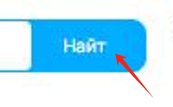|🟢Low|Незначительная ошибка, не влияет на функционал сайта|
|2|Неправильный город на мини карте. СПБ вместо Москвы|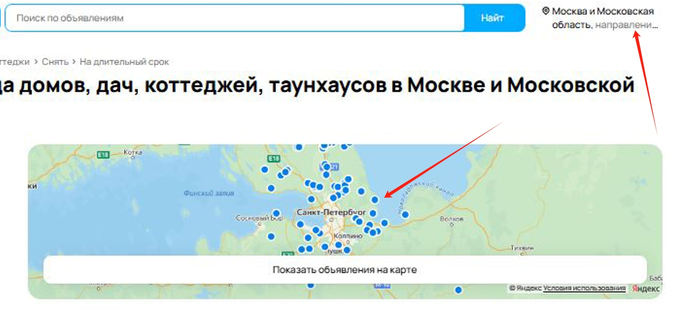|🔴High|Критический баг. Влияет на выдачу объявлений, все объявления из СПБ|
|3|Breadcrumb: некорректная последняя ссылка в цепочке навигации. В фильтрах установлено "посуточно"||🟢Low|Не влияет на выдачу объявлений, однако может смутить пользователя|
|4|Не работает сортировка по дате. Первое объявление - за 2016 год|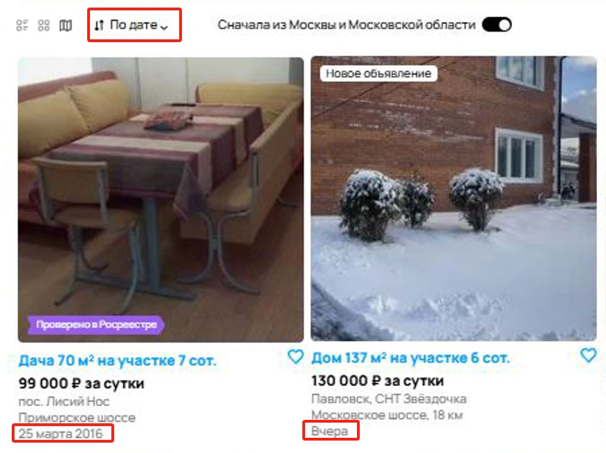|🔴High|Влияет на выдачу объявлений, первыми могут выйти неактуальные объявления|
|5|Не работает вид отображения объявлений. Выбрано "карта", по факту - "плитка"|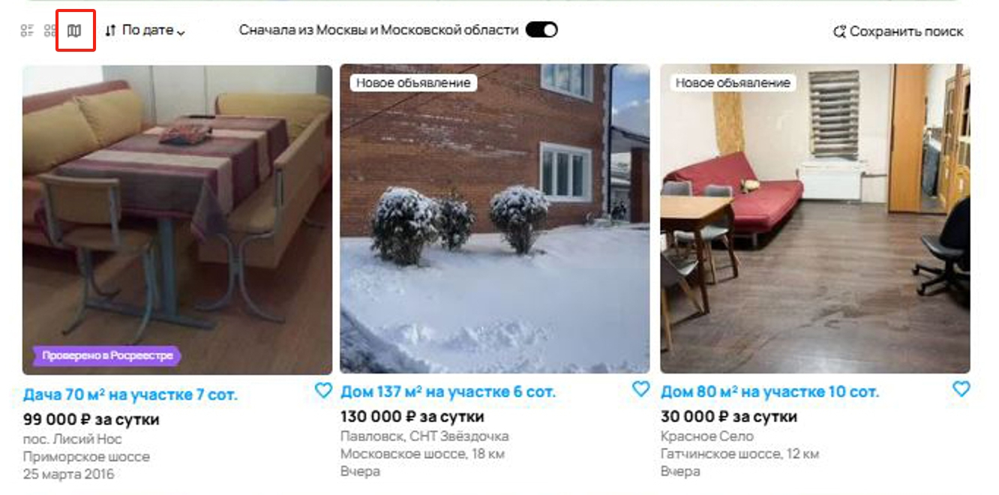|🟡Medium|Не влияет на выдачу объявлений, однако может ухудшить пользовательский опыт|
|6|Не работает фильтр "сначала из Москвы и Московской области"|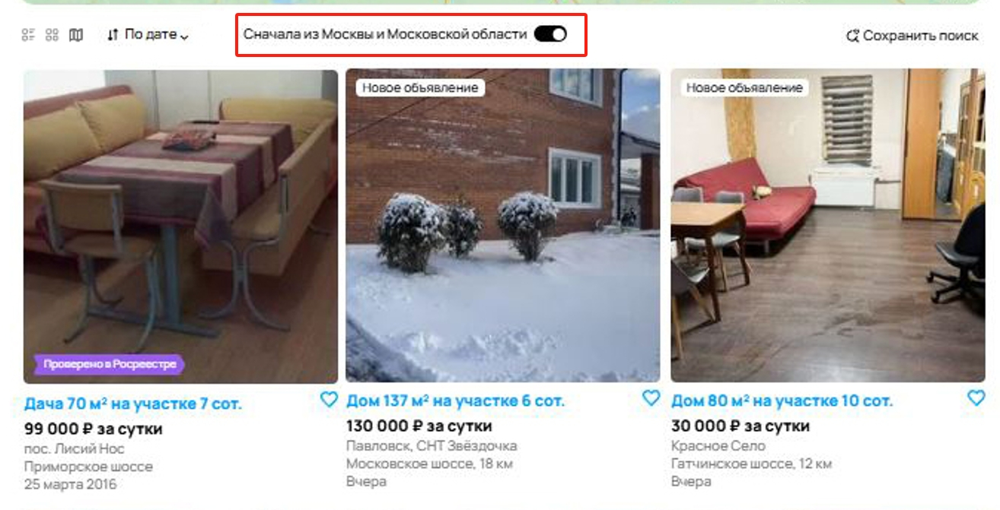|🟡Medium|Как и в баге №2, не работает выдача объявлений из Москвы. Ухудшает пользовательский опыт|
|7|Не работает фильтр цены|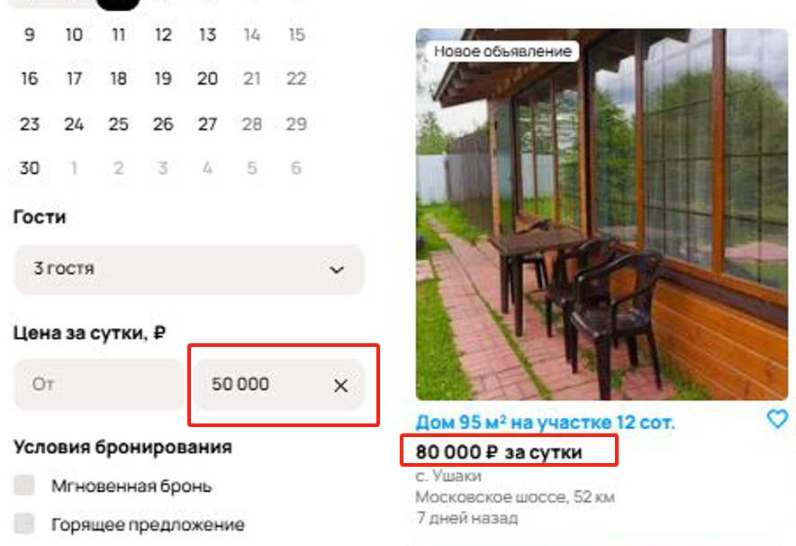|🔴High|Цена - основной критерий для показа объявлений. Не работает фильтр цены = пользователь видит объявления, которые его не интересуют|
|8|Неправильное объявление с ценой за месяц. В фильтре отмечено "посуточно"||🟡Medium|Не так критично, однако ухудшает пользовательский опыт|
|9|Нерелевантное объявление с фотографией игрушечного дома||🔴High|Контент не соответствует контексту. Может вызвать недоумение или подозрение в мошенничестве.|
|10|Некорректное изображение в объявлении||🔴High|Не соответствует категории. Выглядит нерелевантно, но напрямую не мешает использованию.|
|11|Баннер об отсутствии объявлений в выбранной области поиска||🟡Medium|Визуально вводит в заблуждение. Нестыковка текста и факта.|
|12|Отсутствуют объявления в кнопке фильтрации|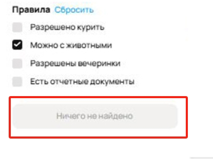|🔴High|Ошибка логики работы фильтров. Ключевой функциональный баг.|
|13|Неправильное отображение цены|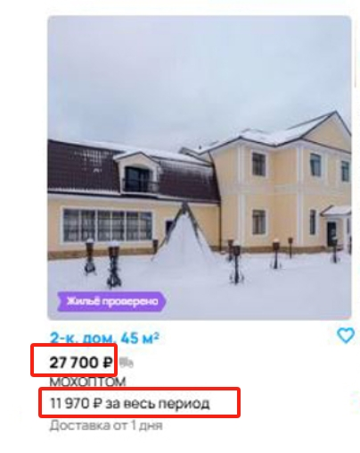|🔴High|	У пользователя нет понимания, за какой период указана цена. Может ввести в заблуждение.|
|14|В объявлении есть доставка|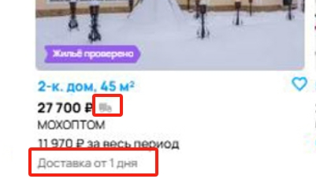|🟡Medium|Некорректный визуальный элемент. Визуальный шум, не мешает взаимодействию. Вводит в заблуждение|
|15|Орфографическая ошибка в слове "койко-места"|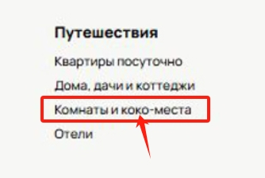|🟢Low|Незначительная ошибка, не влияет на функционал сайта|
|16|Отсутствует цена за весь период в некоторых объявлениях|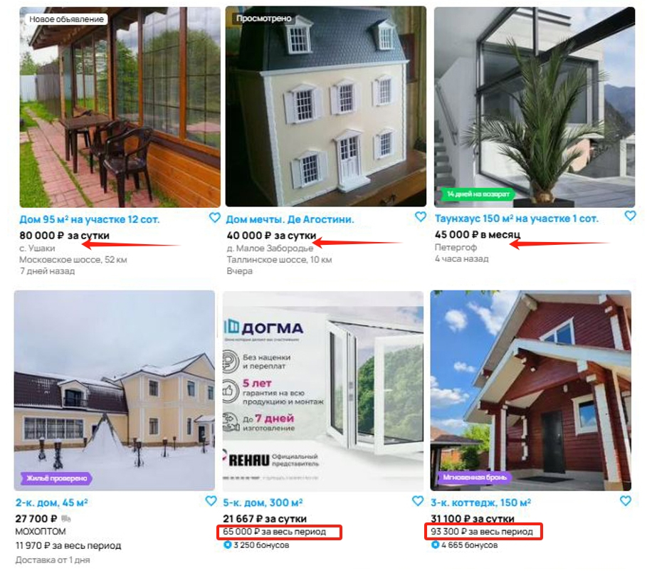|🟡Medium|Ухудшает пользовательский опыт. Пользователю придется самостоятельно просчитывать итоговую цену|
|17|Орфографическая ошибка в фильтрах. "Да" вместо "До"|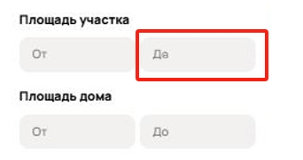|🟢Low|Незначительная ошибка, не влияет на функционал сайта|
|18|Неправильное количество найденных объявлений сверху страницы (6 шт) и фактически выданных (9 шт)||🟡Medium|Нарушается информативность интерфейса — пользователь получает недостоверную информацию о результатах поиска. Это может вводить в заблуждение, особенно при фильтрации или сортировке объявлений.|

